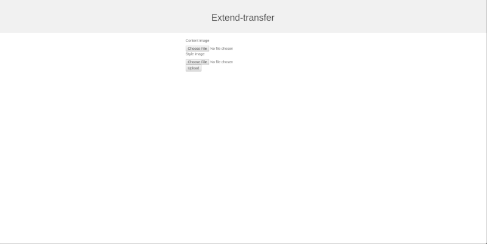
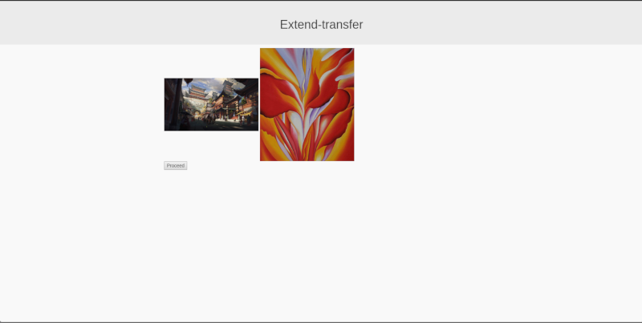
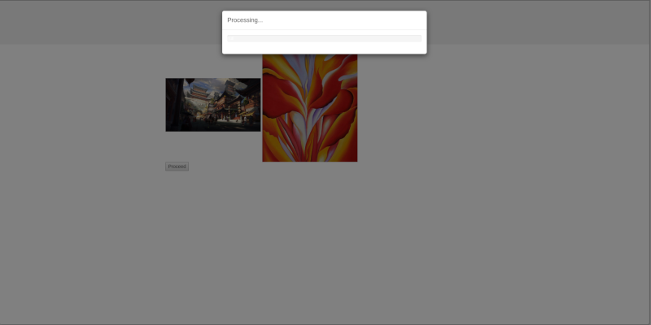
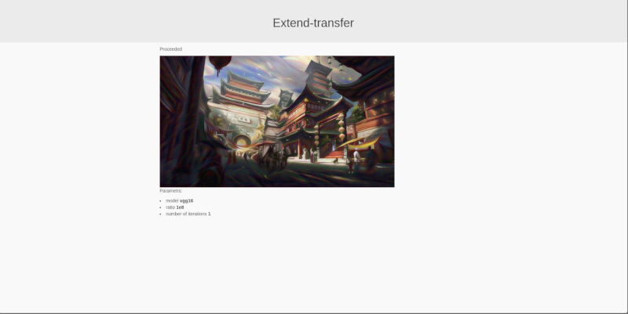

## Extend transfer
*Web service for "style-transfer" image transformation with simple stupid UI*

Extend-transfer is an end-to-end web service that provide simple ui to interact with.

### Backend
Project's approach is to implement asynchronous business logic with queue support. 
This business logic also provides support for multiple workers on separate system resources or 
even separate systems to communicate with each other and execute tasks from same tasks pool. 

Business logic also support multiple users usage by setting unique cookie to every user session.

These features achieved by using this stack of technologies:
 - Keras** *(as a ML framework for style-transfer)*
 - Django *(as a web backend)*
 - Celery *(as a distributed task queue)*
 - RabbitMQ *(as a message broker)*
 - Redis *(as a message broker backend)*

** *Keras backend is Tensorflow*

### Usage

The easiest way to deploy project is by using [docker-compose](https://docs.docker.com/compose/).

You just need to install it. The go to the project's root folder and execute command.

`$ docker-compose -f docker/docker-compose.yml up`

This command will build necessary image and run necessary containers with services.

*Note: docker image quite heavy (almoust 3.2GB)*

After launching services, you'll have web ui at

`http://0.0.0.0:8000`

with ability to test application.

### Example
| Steps of process             |   |
:-------------------------:|:-------------------------:
 |
 |
 |
 |

