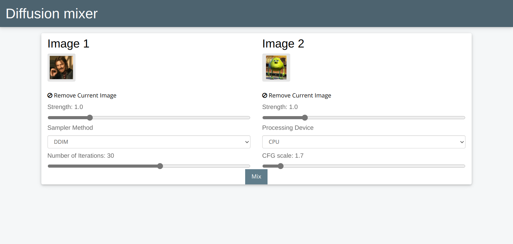
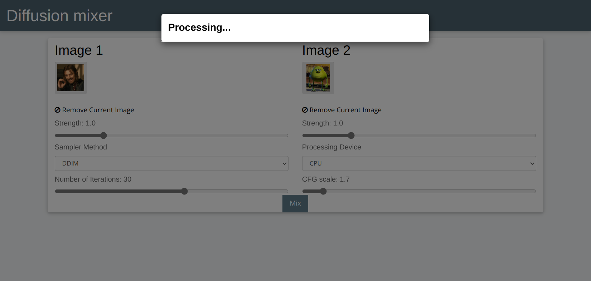
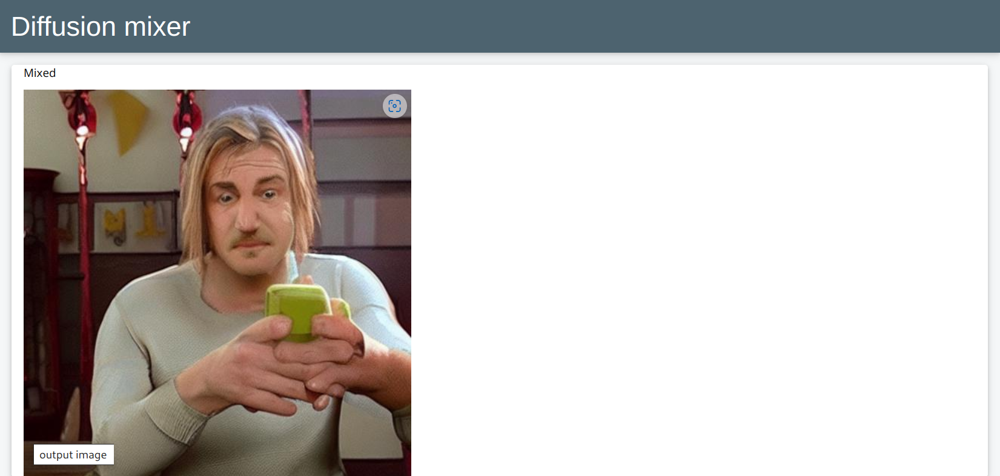

## Diffusion mixer
*Web service for mixing two images into new one.*

Diffusion mixer is an end-to-end web service that provide simple ui to interact with.

### Backend
Project's approach is to implement asynchronous business logic with queue support. 
This business logic also provides support for multiple workers on separate system resources or 
even separate systems to communicate with each other and execute tasks from same tasks pool. 

Business logic also support multiple users usage by setting unique cookie to every user session.

These features achieved by using this stack of technologies:
 - Pytorch** *(as a ML framework)*
 - Django *(as a web backend)*
 - Celery *(as a distributed task queue)*
 - RabbitMQ *(as a message broker)*
 - Redis *(as a message broker backend)*

<!-- ** *Keras backend is Tensorflow* -->

### Usage

Currently only manual installation through `docker/requirements.txt` is supported.

You can install it through `pip3 install -r docker/requirements.txt`

### Example
| Steps of process             |   |
:-------------------------:|:-------------------------:
 |
 |
 |

